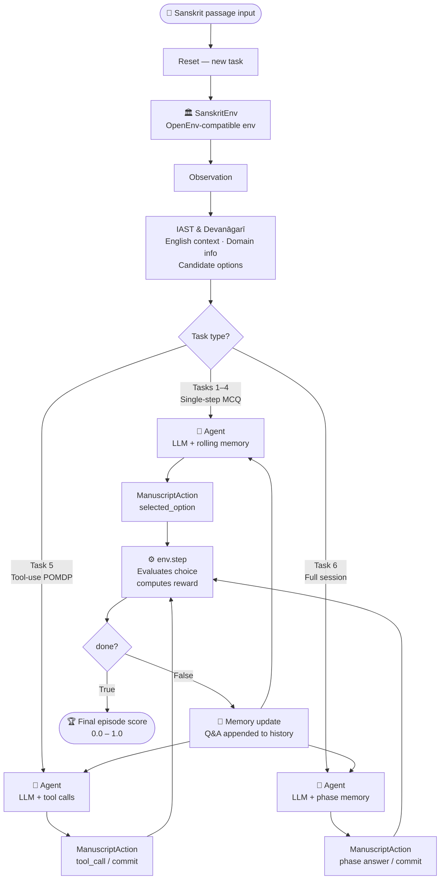

# SanskritEnv

**An OpenEnv-compatible RL environment for Sanskrit manuscript interpretation.**  
Train and evaluate AI agents on the task of resolving structural linguistic ambiguity in ancient Indian texts — a real bottleneck in ongoing digitization projects backed by the Indian government.

[](https://github.com/meta-pytorch/OpenEnv)
[](https://huggingface.co/spaces/Adityahars/Sanskrit-env)
[](LICENSE)
[](https://www.python.org/)

---

## Real-World Impact

India possesses an estimated **1 crore Sanskrit manuscripts** written in over 80 scripts and 60 languages — the largest manuscript collection of any civilisation on Earth.

The **Union Budget 2025-26** allocated ₹60 crore to digitize over 1 crore manuscripts under the **Gyan Bharatam Mission**. As of 2025, metadata for 52 lakh manuscripts has been recorded — but only **1.3 lakh** have been uploaded online. Digitization is accelerating. Translation is not.

The reason is a collapse in human expertise. Trained Sanskrit scholars capable of reading classical manuscripts are retiring faster than new scholars can replace them. The Government's own **National Mission for Manuscripts** states directly:

> *"Scholars who can study and use manuscripts are fast disappearing and a new generation of scholars is not able to rise to the challenge."*

A nationwide survey launched in 2026 confirmed the crisis is active and growing. The ratio of trained scholars to digitized texts is estimated at **1:10,000** and widening every year.

The six linguistic problems that block automated translation of these manuscripts are:

1. A single Sanskrit term can carry 4–6 domain-specific meanings with no contextual signal (**lexical ambiguity**).
2. Compound words have multiple valid phonological splits with different meanings (**sandhi ambiguity**).
3. Compound words must be structurally classified before they can be parsed (**samāsa ambiguity**).
4. Pronouns and implicit subjects span multiple verses with no explicit antecedent markers (**referential ambiguity**).
5. Interpretation requires gathering and weighing philological tool evidence before committing to a reading (**evidential reasoning**).
6. All five layers must be resolved consistently across phases of a single document without contradiction (**compositional consistency**).

SanskritEnv is the **first RL environment** built to train agents on all six of these problems — using real passages from Ayurvedic, astronomical, philosophical, and narrative manuscripts currently sitting in India's national repositories.

---

## The Six Linguistic Layers

Projects like eGangotri have already rescued and scanned more than 60,000 rare texts and 1.4 crore pages. The bottleneck is not scanning technology — it is the shortage of scholars who can read classical Sanskrit across six major difficulty layers:

| Layer | Task | Problem | What blocks automation |
|---|---|---|---|
| Lexical | Glossary Anchoring | A single term (e.g. `agni`) has 4–6 domain-specific meanings | No contextual disambiguation |
| Phonological | Sandhi Resolution | Compound words have multiple valid phonological splits | Requires grammatical + contextual reasoning |
| Morphological | Samāsa Classification | Compound words must be classified before they can be parsed | Requires grammatical meta-knowledge |
| Discourse | Referential Coherence | Pronouns and implicit subjects span multiple verses | Requires cross-sentence coreference tracking |
| Evidential | Manuscript Restoration | Interpretation requires weighing philological tool evidence before committing | No automated evidence-gathering pipeline for classical texts |
| Compositional | Full Manuscript Session | All five layers must be resolved consistently across phases of a single document | Cross-layer contradictions collapse downstream parsing |

The first four layers are cited by Murugesh et al. (2019) *"A Survey of Sanskrit NLP"* as the primary obstacles to automated translation. SanskritEnv extends this benchmark with two higher-order layers — Evidential (tool-use POMDP) and Compositional (cross-phase consistency) — that no existing OpenEnv environment addresses.

---

## Environment Overview

SanskritEnv is a **decision environment**, not a translation model. At each step the agent receives a Sanskrit passage and must select the correct linguistic interpretation from deterministically-graded options.

### Architecture



Six tasks of escalating difficulty:

- **Tasks 1–4** are single-step MCQ skill drills targeting one linguistic layer each.
- **Task 5** is a full tool-use POMDP (manuscript restoration) with a commit action.
- **Task 6** is a long-horizon full session chaining all five skills with cross-phase consistency scoring.

| Task | ID | Type | Steps/Episode | Core Challenge |
|---|---|---|---|---|
| 1 | `glossary_anchoring` | Single-step MCQ | 1 | Domain-specific term disambiguation |
| 2 | `sandhi_resolution` | Single-step MCQ | 1 | Phonological compound splitting |
| 3 | `samasa_classification` | Single-step MCQ | 1 | Grammatical compound type identification |
| 4 | `referential_coherence` | Multi-step MCQ | 4–7 | Cross-verse pronoun tracking |
| 5 | `manuscript_restoration` | Tool-use POMDP | Variable | Evidence gathering + deterministic commit |
| 6 | `full_manuscript_session` | Long-horizon chain | Multi-phase | All skills + cross-phase consistency |

---

## Dataset Statistics

| Task | Episodes | Domains | Difficulty |
|---|---|---|---|
| Glossary Anchoring | 150 | Ayurveda, Astronomy, Philosophy | Easy |
| Sandhi Resolution | 150 | Philosophy, Ayurveda, Narrative | Medium |
| Samāsa Classification | 150 | Philosophy, Narrative, Ayurveda, Astronomy | Medium |
| Referential Coherence | 150 | Narrative, Philosophy | Hard |
| Manuscript Restoration | 150 | Ayurveda, Philosophy, Narrative, Astronomy | Adaptive (Beginner → Expert) |
| Full Manuscript Session | 150 | All domains | Hard |

Each task has **150 unique hand-annotated episodes** in the data files (900 total). During GRPO training, the trainer dynamically varies seeds over this base pool to generate diverse `(prompt, seed)` pairs without requiring additional annotation.

---

## Grader Design — Why No LLM, No BLEU

All six graders are **fully deterministic**:

- No LLM judge calls
- No BLEU/ROUGE — unreliable for Sanskrit free word order
- Exact string match against pre-annotated answer tables embedded in data JSON

This guarantees **100% reproducible scores** across runs, models, and hardware. Two runs with the same seed will always produce identical scores.

---

## Reward Structure

### Tasks 1–4 (Single-Step MCQ)

Wrong answers always return exactly `0.0`. This is intentional for GRPO compatibility, not a floor.

The advantage normalization formula:

```
A_i = (r_i - mean(group)) / (std(group) + epsilon)
```

With a floor around `0.5`, group standard deviation typically collapses near `0.10–0.15`, producing weak training signal. With true zero for wrong answers, standard deviation typically rises near `0.35–0.45`, yielding stronger group-relative advantages.

| Outcome | Raw | Shaped |
|---|---|---|
| Full credit | 1.00 | 0.95 |
| Partial credit | 0.40 | 0.50 |
| Adjacent sandhi | 0.25 | 0.25 |
| Wrong | 0.00 | 0.00 |

Reward shaping applied in the environment:

- `raw = 0.0` → `0.0` (unchanged)
- `0.0 < raw < 0.40` → linear identity (`shaped = raw`)
- `0.40 ≤ raw ≤ 1.00` → `shaped = 0.50 + (raw − 0.40) × (0.45 / 0.60)`

### Task 5 — Manuscript Restoration (POMDP)

**Per-step tool reward:**

```
tool_reward = relevance_bonus + workflow_bonus − redundancy_penalty
```

| Condition | Reward |
|---|---|
| PRIMARY tool for episode type | +0.08 |
| SECOND tool (PRIMARY already used) | +0.05 |
| SECOND tool (PRIMARY not yet used) | +0.04 |
| Supporting tool | +0.04 |
| Redundant call (same tool + same input) | −0.05 |
| Irrelevant tool (e.g. `meter_checker` on prose) | −0.05 |

**Workflow pair bonuses:**

| Pair | Bonus |
|---|---|
| `sandhi_parser → meter_checker` | +0.05 |
| `lexicon_lookup → commentary_fetch` | +0.05 |
| `witness_compare → referent_tracker` | +0.03 |

**Terminal commit reward:**

```
terminal_reward = r_correctness × M_evidence − P_budget
```

Where:
- `M_evidence = 0.60 + 0.40 × (distinct_relevant_tools_used / tools_needed)` (range 0.60–1.00)
- `P_budget = 0.10 × max(0, steps_used − ideal_steps) / tool_budget` (range 0.00–0.10)

Critical invariants:
- Wrong commit → `0.0` regardless of evidence gathered
- Episode score is the terminal commit reward only
- Tool rewards are dense intermediate signals and are **not** added into the final episode score

### Task 6 — Full Manuscript Session

```
session_score = mean(phase_rewards) − consistency_penalty + consistency_bonus
```

| Rule | Effect |
|---|---|
| Each contradiction between phases | −0.05 per violation |
| Zero violations across all phases | +0.05 bonus |

A violation occurs when the restoration-phase final interpretation contradicts an answer given in an earlier phase.

---

## The Six Philological Tools (Task 5)

| Tool | Input | Returns | PRIMARY for |
|---|---|---|---|
| `lexicon_lookup` | Sanskrit lemma/term | Domain-conditioned meanings and glosses | glossary episodes |
| `sandhi_parser` | Compound form | Candidate splits with rule-level structure | sandhi, samasa episodes |
| `meter_checker` | Candidate split/text span | Meter compatibility signal | SECOND in sandhi/samasa |
| `commentary_fetch` | Term, phrase, or verse reference | Commentary snippets linked to interpretation | SECOND in glossary |
| `witness_compare` | Verse/manuscript locus | Variant witness readings and differences | support (glossary/sandhi/coherence) |
| `referent_tracker` | Pronoun/entity cue | Candidate antecedents and discourse links | coherence episodes |

### Tool Relevance Matrix

| Episode type | `lexicon_lookup` | `sandhi_parser` | `meter_checker` | `commentary_fetch` | `witness_compare` | `referent_tracker` |
|---|---|---|---|---|---|---|
| glossary | PRIMARY | support | none | SECOND | support | none |
| sandhi | support | PRIMARY | SECOND | none | support | none |
| samasa | support | PRIMARY | SECOND | none | none | none |
| coherence | support | support | none | support | support | PRIMARY |

---

## Adaptive Difficulty Curriculum (Task 5)

| Level | OCR Noise | Commentary | Tool Budget |
|---|---|---|---|
| Beginner | None | Full | 8 |
| Intermediate | 10% | Partial | 6 |
| Hard | 25% | Partial | 5 |
| Expert | 40% + conflicting witnesses | None | 4 |

**Promotion threshold:** mean of last 10 scores > 0.80 with at least 5 episodes  
**De-escalation threshold:** mean < 0.45

---

## Project Setup — Local Development

**1. Clone the repository:**

```bash
git clone https://huggingface.co/spaces/Adityahars/Sanskrit-env
cd sanskrit-env
```

**2. Create and activate a virtual environment (Python 3.11+):**

```bash
python -m venv .venv

# PowerShell
.venv\Scripts\Activate.ps1

# bash / zsh
source .venv/bin/activate
```

**3. Install dependencies:**

```bash
pip install -r requirements.txt
```

**4. Configure environment variables:**

```bash
cp .env.example .env
# Fill in HF_TOKEN and CLOUDFLARE_API_TOKEN / CLOUDFLARE_ACCOUNT_ID
```

**5. Start the server:**

```bash
python -m uvicorn server.app:app --host 0.0.0.0 --port 7860 --reload
```

**6. Validate:**

```bash
curl http://localhost:7860/health
```

**7. Run the test agent:**

```bash
python test_agent.py --local --task all --episodes 5
```

---

## Project Setup — Docker

```bash
# Build
docker build -t sanskrit-env:local .

# Run
docker run --rm -p 7860:7860 sanskrit-env:local

# Validate
curl http://localhost:7860/health
```

---

## GRPO Training

Train a fine-tuned adapter on SanskritEnv using HuggingFace Jobs (A100 GPU):

```powershell
# Set credentials in .env, then:
$env:HF_TOKEN = "hf_..."
python training/submit_hf_job.py --push-to-hub --flavor a100-large --timeout 12h
```

All training hyperparameters are controlled via `.env` — no hardcoded values in scripts:

| Variable | Description |
|---|---|
| `MODEL_ID` | Base model or checkpoint to fine-tune |
| `EPISODES_PER_TASK` | Episodes generated per task (default: 1500) |
| `TRAIN_EPOCHS` | Training epochs (default: 1.0) |
| `GROUP_SIZE` | GRPO group size (default: 8) |
| `LR` | Learning rate (default: 2e-6) |
| `LORA_R` / `LORA_ALPHA` | LoRA rank and scaling |
| `PUSH_TO_HUB` | Set to `1` to push adapter to Hub after training |
| `HUB_MODEL_ID` | Hub repo for the trained adapter |

See `.env.example` for the full list.

---

## Running `inference.py` (Submission Script)

`inference.py` is the OpenEnv submission artifact. It follows output constraints strictly:

- Stdout contains only `[START]`, `[STEP]`, and `[END]` lines
- Debug/error details go to stderr
- All settings are pulled from environment variables

```bash
export HF_TOKEN=your_token
export API_BASE_URL=https://router.huggingface.co/v1
export MODEL_NAME=Qwen/Qwen2.5-72B-Instruct
python inference.py
```

---

## Running `test_agent.py` (Development Evaluation)

`test_agent.py` is the development evaluation runner. It supports both remote and local environments.

```bash
# All tasks against the HF Space (default)
python test_agent.py --task all --episodes 5

# All tasks against localhost
python test_agent.py --local --task all --episodes 5

# Single task with verbose output
python test_agent.py --task referential_coherence --episodes 1 --verbose

# Task 5 at hard difficulty
python test_agent.py --task manuscript_restoration --difficulty hard --episodes 10

# Task 6 full session
python test_agent.py --task full_manuscript_session --episodes 3
```

---

## Test Results

Model: `@cf/meta/llama-3.2-3b-instruct` · Provider: `cloudflare`

### Run 1 — Seed `42` · 3 episodes per task · Overall mean `0.465`, std `0.352`

| Task | Episodes | Score Mean | Score Std |
|---|---:|---:|---:|
| Glossary Anchoring | 3 | 0.333 | 0.236 |
| Sandhi Resolution | 3 | 0.400 | 0.402 |
| Samāsa Classification | 3 | 0.483 | 0.388 |
| Referential Coherence | 3 | 0.067 | 0.047 |
| Manuscript Restoration | 3 | 0.650 | 0.000 |
| Full Manuscript Session | 3 | 0.857 | 0.066 |

### Run 2 — 25 episodes (Tasks 1–4) · 10 episodes (Tasks 5–6) · Overall mean `0.478`, std `0.399`

| Task | Episodes | Score Mean | Score Std | Notes |
|---|---:|---:|---:|---|
| Glossary Anchoring | 25 | 0.444 | 0.402 | |
| Sandhi Resolution | 25 | 0.630 | 0.399 | |
| Samāsa Classification | 25 | 0.386 | 0.405 | |
| Referential Coherence | 25 | 0.278 | 0.345 | |
| Manuscript Restoration | 10 | 0.573 | 0.304 | mean tools used: 1.4 · mean steps: 2.4 |
| Full Manuscript Session | 10 | 0.824 | 0.042 | |

---

## Citation

```bibtex
@misc{sanskritenv2026,
  title   = {SanskritEnv: A Reinforcement Learning Environment for Sanskrit Manuscript Interpretation},
  author  = {Meta\_Mesh},
  year    = {2026},
  url     = {https://huggingface.co/spaces/Adityahars/Sanskrit-env},
  note    = {OpenEnv-compatible environment for structured linguistic ambiguity resolution}
}
```

---

## License

Apache 2.0 — see [LICENSE](LICENSE).  
Sanskrit texts used are in the public domain (composed before 1928). Annotations, graders, and environment code are original to this project.

---

## Acknowledgements

- [Meta × HuggingFace OpenEnv](https://github.com/meta-pytorch/OpenEnv) — environment framework
- [Gyan Bharatam Mission](https://indiaculture.gov.in/) — the real-world problem this addresses
- [Monier-Williams Sanskrit Dictionary](https://www.sanskrit-lexicon.uni-koeln.de/) — lexical reference
- [Sanskrit Sandhi Split Sighum](https://github.com/DorenaBudajeva/sighum) — annotated corpus reference
- [Itihasa](https://github.com/goru001/nlp-for-sanskrit) — annotated corpus reference
